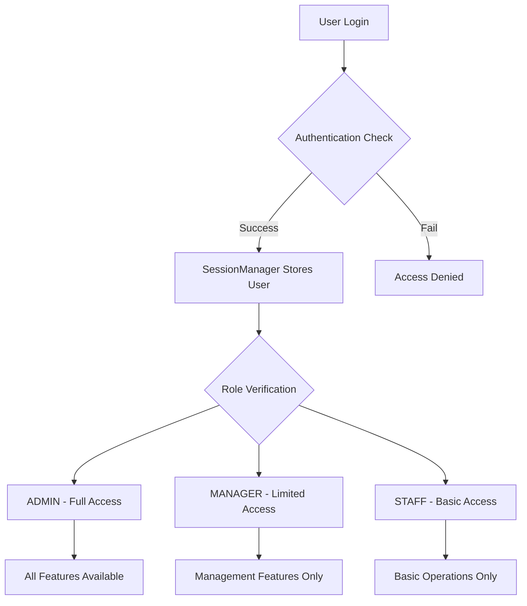

# 🏪 Quản Lý Cửa Hàng Quần Áo (Clothing Store Management System)

[](https://www.oracle.com/java/)
[](https://jakarta.ee/specifications/persistence/)
[](https://hibernate.org/)
[](https://maven.apache.org/)
[](https://www.microsoft.com/en-us/sql-server/)
[](LICENSE)

## 📋 Table of Contents

- [Overview](#overview)
- [🏗️ Architecture](#architecture)
- [🎯 Design Patterns](#design-patterns)
- [✨ Core Features](#core-features)
- [🆕 Advanced Features](#advanced-features)
- [📁 Project Structure](#project-structure)
- [⚙️ Setup & Installation](#setup--installation)
- [🔧 Configuration](#configuration)
- [📊 Database Schema](#database-schema)
- [🎨 User Interface](#user-interface)
- [🔐 Security & Authentication](#security--authentication)
- [📖 Usage Guide](#usage-guide)
- [🧪 Testing](#testing)
- [🚀 Deployment](#deployment)
- [🤝 Contributing](#contributing)
- [📄 License](#license)
- [🆘 Troubleshooting](#troubleshooting)

## Overview

**Quản Lý Cửa Hàng Quần Áo** is a comprehensive, enterprise-grade clothing store management system built with modern Java technologies and clean architecture principles. This application provides end-to-end solutions for retail clothing businesses, from inventory management to customer loyalty programs.

### 🎯 **Key Highlights**
- **Clean Architecture** implementation with clear separation of concerns
- **Role-Based Access Control (RBAC)** with 3-tier permission system
- **Advanced Features**: Returns/Exchanges, Loyalty Cards, Supplier Management, Reporting
- **Modern Tech Stack**: Java 21, JPA 3.2, Hibernate 7.0, SQL Server
- **Professional Design Patterns**: 8 Gang of Four patterns implemented
- **Enterprise Security**: BCrypt password hashing, session management
- **PDF Generation**: Automated invoice and receipt generation
- **Vietnamese Language Support**: Full localization for Vietnamese market

## 🏗️ Architecture

### **Clean Architecture Implementation**

The application follows **Clean Architecture** principles with clear separation of concerns across multiple layers:

```
┌─────────────────────────────────────────────────────────┐
│                    Presentation Layer                   │
│  ┌─────────────────┐    ┌─────────────────────────────┐ │
│  │   Swing UI      │───▶│      Controllers            │ │
│  │   Components    │    │   (UI-Service Bridge)       │ │
│  └─────────────────┘    └─────────────────────────────┘ │
└─────────────────────────────────────────────────────────┘
                                  │
                                  ▼
┌─────────────────────────────────────────────────────────┐
│                  Business Logic Layer                   │
│  ┌─────────────────┐    ┌─────────────────────────────┐ │
│  │    Services     │───▶│       Validators            │ │
│  │ (Business Logic)│    │   (Business Rules)          │ │
│  └─────────────────┘    └─────────────────────────────┘ │
└─────────────────────────────────────────────────────────┘
                                  │
                                  ▼
┌─────────────────────────────────────────────────────────┐
│                  Data Access Layer                      │
│  ┌─────────────────┐    ┌─────────────────────────────┐ │
│  │  DAO Interfaces │───▶│    DAO Implementations      │ │
│  │   (Contracts)   │    │     (Data Access)           │ │
│  └─────────────────┘    └─────────────────────────────┘ │
└─────────────────────────────────────────────────────────┘
                                  │
                                  ▼
┌─────────────────────────────────────────────────────────┐
│                    Infrastructure Layer                 │
│  ┌─────────────────┐    ┌─────────────────────────────┐ │
│  │  DI Container   │    │   EntityManager Utility     │ │
│  │   Exception     │    │     Database Config         │ │
│  │   Framework     │    │     Session Management      │ │
│  └─────────────────┘    └─────────────────────────────┘ │
└─────────────────────────────────────────────────────────┘
                                  │
                                  ▼
┌─────────────────────────────────────────────────────────┐
│                      Domain Layer                       │
│  ┌──────���──────────────────────────────────────────────┐ │
│  │              JPA Entities (Domain Models)           │ │
│  │   SanPham │ TaiKhoan │ NhanVien │ HoaDon │ etc.    │ │
│  └─────────────────────────────────────────────────────┘ │
└─────────────────────────────────────────────────────────┘
```

## 🎯 Design Patterns

This project implements **8 professional design patterns** following Gang of Four and enterprise patterns:

### **1. 🔧 Singleton Pattern**
**Implementation**: `ServiceContainer`, `EntityManagerUtil`, `SessionManager`

```java
public class ServiceContainer {
    private static ServiceContainer instance;
    
    public static synchronized ServiceContainer getInstance() {
        if (instance == null) {
            instance = new ServiceContainer();
        }
        return instance;
    }
}
```

### **2. 📋 Template Method Pattern**
**Implementation**: `BaseDAO<T, ID>` abstract class

```java
public abstract class BaseDAO<T, ID> {
    // Template method defining algorithm structure
    public void insert(T entity) {
        validateEntity(entity);  // Hook method
        EntityManagerUtil.executeInTransaction(em -> {
            em.persist(entity);
        });
    }
    
    // Hook method for subclasses to override
    protected void validateEntity(T entity) {
        // Default validation
    }
}
```

### **3. 🎭 Strategy Pattern**
**Implementation**: `Validator<T>` interface with multiple implementations

```java
public interface Validator<T> {
    ValidationResult validate(T object);
}

public class SanPhamValidator implements Validator<SanPham> {
    public ValidationResult validate(SanPham product) {
        // Product-specific validation logic
    }
}
```

### **4. 🏭 Factory Pattern**
**Implementation**: `ApplicationConfig` for service creation

```java
public class ApplicationConfig {
    private static void registerServices(ServiceContainer container) {
        container.registerSingletonFactory(ISanPhamService.class, () -> {
            ISanPhamDAO dao = container.getService(ISanPhamDAO.class);
            return new SanPhamServiceImpl(dao);
        });
    }
}
```

### **5. 📦 Repository Pattern**
**Implementation**: DAO layer with interfaces and implementations

```java
public interface ISanPhamDAO {
    void insert(SanPham sp);
    Optional<SanPham> findById(int id);
    List<SanPham> findAll();
}

public class SanPhamDAO extends BaseDAO<SanPham, Integer> implements ISanPhamDAO {
    // Repository implementation
}
```

### **6. 💉 Dependency Injection Pattern**
**Implementation**: Custom DI container with lifecycle management

```java
// Registration
container.registerSingleton(ISanPhamDAO.class, new SanPhamDAO());

// Injection
public class SanPhamController {
    private final ISanPhamService service;
    
    public SanPhamController() {
        this.service = ApplicationConfig.getService(ISanPhamService.class);
    }
}
```

### **7. 🏛️ MVC (Model-View-Controller) Pattern**
**Implementation**: Separation between UI, controllers, and models

```java
// Model (Domain)
@Entity public class SanPham { /* JPA Entity */ }

// View (Presentation)
public class SanPhamUI extends JFrame { /* Swing UI */ }

// Controller (Coordination)
public class SanPhamController { /* UI-Service Bridge */ }
```

### **8. 🎯 Command Pattern**
**Implementation**: Service methods as commands with validation and error handling

```java
public class SanPhamServiceImpl implements ISanPhamService {
    public void createProduct(SanPham product) throws ValidationException, BusinessException {
        // Validation Command
        ValidationResult result = validator.validate(product);
        if (!result.isValid()) {
            throw new ValidationException(result.getErrors());
        }
        
        // Business Logic Command
        if (isProductNameExists(product.getName())) {
            throw new BusinessException("Product name already exists");
        }
        
        // Persistence Command
        productDAO.insert(product);
    }
}
```

## ✅ SOLID Principles

### **S - Single Responsibility Principle**
✅ **Implemented**: Each class has one reason to change
- **Controllers**: Only handle UI-Service communication
- **Services**: Only contain business logic
- **DAOs**: Only handle data access
- **Validators**: Only handle validation logic

### **O - Open/Closed Principle**
✅ **Implemented**: Open for extension, closed for modification
- `BaseDAO` can be extended without modification
- New validators can be added without changing existing code
- Service interfaces allow new implementations

### **L - Liskov Substitution Principle**
✅ **Implemented**: Derived classes are substitutable for base classes
- All DAO implementations are interchangeable through interfaces
- Service implementations follow their contracts exactly

### **I - Interface Segregation Principle**
✅ **Implemented**: Clients depend only on interfaces they use
- Focused interfaces: `ISanPhamDAO`, `ITaiKhoanDAO`, etc.
- No fat interfaces with unused methods

### **D - Dependency Inversion Principle**
✅ **Implemented**: Depend on abstractions, not concretions
- High-level modules depend on interfaces
- Dependencies injected through constructor
- Easy to swap implementations

## ✨ Core Features

### **👥 User & Employee Management**
- **Multi-role authentication system** (Admin, Manager, Staff)
- **Secure password hashing** with BCrypt encryption
- **Session management** with automatic timeout and cleanup
- **Role-based access control (RBAC)** with granular permissions
- **Employee profile management** with comprehensive information tracking
- **Work status monitoring** and employee performance tracking

### **📦 Product & Inventory Management**
- **Complete product lifecycle management** (CRUD operations)
- **Hierarchical category management** with unlimited depth
- **Product variant management** (size, color, quantity, pricing)
- **Advanced search and filtering** with Vietnamese language support
- **Real-time inventory tracking** and stock level monitoring
- **Low stock alerts** and automated reorder notifications
- **Barcode support** for quick product identification

### **🧾 Sales & Invoice Management**
- **Comprehensive invoice creation and management**
- **Multi-payment method support** (Cash, Card, Bank Transfer)
- **Real-time inventory updates** during sales transactions
- **Customer information management** with purchase history
- **PDF invoice generation** with professional formatting
- **Sales analytics** and performance tracking
- **Discount and promotion application**

### **🔐 Security & Authentication**
- **Enterprise-grade authentication** with session management
- **BCrypt password hashing** with salt for maximum security
- **Role-based authorization** at UI, controller, and service levels
- **Input validation and sanitization** across all layers
- **SQL injection prevention** through parameterized queries
- **Audit logging** for all critical operations

## 🆕 Advanced Features

### **🔄 Returns & Exchange System**
- **Comprehensive return/exchange workflow** with approval process
- **30-day return policy** with automatic validation
- **Multi-step approval process** (Pending → Approved → Completed)
- **Refund management** with multiple payment methods
- **Return reason tracking** and analytics
- **PDF return receipt generation**
- **Inventory adjustment** upon return completion

### **💳 Loyalty Card System**
- **5-tier loyalty program**: Bronze, Silver, Gold, Platinum, Diamond
- **Automatic point accumulation** based on purchase amount
- **Tier-based benefits**: 1%-3% cashback, 0%-10% discounts
- **Point redemption system** for future purchases
- **Loyalty card management** with unique card numbers
- **Point history tracking** and expiration management
- **Customer tier upgrade** based on spending thresholds

### **🎁 Promotion & Discount System**
- **Multiple promotion types**: Percentage, Fixed Amount, Buy X Get Y
- **Flexible promotion rules** with date ranges and conditions
- **Automatic promotion application** based on cart contents
- **Promotion code system** for targeted marketing
- **Category and product-specific promotions**
- **Customer group targeting** for personalized offers

### **🏢 Supplier & Purchase Management**
- **Comprehensive supplier database** with contact information
- **Supplier performance tracking** with rating system
- **Purchase order management** with approval workflow
- **Delivery tracking** and receipt confirmation
- **Supplier payment terms** and credit management
- **Purchase analytics** and cost optimization

### **📊 Advanced Reporting & Analytics**
- **Revenue analytics** with time-based comparisons
- **Product performance reports** with sales trends
- **Customer behavior analysis** and segmentation
- **Inventory turnover reports** and optimization suggestions
- **Employee performance tracking** and commission calculations
- **Profit margin analysis** by product and category
- **Export capabilities** to PDF and Excel formats

### **💰 Payment Method Management**
- **Multiple payment method support** (Cash, Credit Card, Bank Transfer, E-wallet)
- **Payment method configuration** with fees and limits
- **Transaction tracking** and reconciliation
- **Split payment support** for large transactions
- **Payment analytics** and processing fee optimization

## 📁 Project Structure

```
src/main/java/
├── 📋 config/
│   └── ApplicationConfig.java          # 🏭 Factory pattern for DI setup
├── 🎮 controller/
│   ├── SanPhamController.java          # 🏪 Product management controller
│   ├── TaiKhoanController.java         # 👤 Account management controller
│   ├── HoaDonController.java           # 🧾 Invoice operations controller
│   ├── BienTheSanPhamController.java   # 📦 Product variant controller
│   ├── KhachHangController.java        # 👥 Customer management controller
│   ├── NhanVienController.java         # 👔 Employee management controller
│   ├── DanhMucController.java          # 📂 Category management controller
│   ├── MauSacController.java           # 🎨 Color management controller
│   ├── KichThuocController.java        # 📏 Size management controller
│   └── ChiTietHoaDonController.java    # 📋 Invoice detail controller
├── 🗄️ dao/
│   ├── base/
│   │   └── BaseDAO.java                # 📋 Template Method pattern base class
│   ├── interfaces/
│   │   ├── ISanPhamDAO.java            # 🏪 Product data access interface
│   │   ├── ITaiKhoanDAO.java           # 👤 Account data access interface
│   │   ├── IHoaDonDAO.java             # 🧾 Invoice data access interface
│   │   ├── IBienTheSanPhamDAO.java     # 📦 Product variant data access
│   │   ├── IKhachHangDAO.java          # 👥 Customer data access interface
│   │   ├── INhanVienDAO.java           # 👔 Employee data access interface
│   │   ├── IDanhMucDAO.java            # 📂 Category data access interface
│   │   ├── IMauSacDAO.java             # 🎨 Color data access interface
│   │   ├── IKichThuocDAO.java          # 📏 Size data access interface
│   │   ├── IChiTietHoaDonDAO.java      # 📋 Invoice detail data access
│   │   ├── IPhieuDoiTraDAO.java        # 🔄 Return/Exchange data access
│   │   ├── ITheThanThietDAO.java       # 💳 Loyalty card data access
│   │   ├── INhaCungCapDAO.java         # 🏢 Supplier data access interface
│   │   ├── IBaoCaoDAO.java             # 📊 Report data access interface
│   │   ├── IHinhThucThanhToanDAO.java  # 💰 Payment method data access
│   │   ├── ILichSuDiemDAO.java         # 📈 Point history data access
│   │   └── IChiTietPhieuDoiTraDAO.java # 🔄 Return detail data access
│   └── impl/
│       ├── SanPhamDAO.java             # 🏪 Product data implementation
│       ├── TaiKhoanDAO.java            # 👤 Account data implementation
│       ├── HoaDonDAO.java              # 🧾 Invoice data implementation
│       ├── BienTheSanPhamDAO.java      # 📦 Product variant implementation
│       ├── KhachHangDAO.java           # 👥 Customer data implementation
│       ├── NhanVienDAO.java            # 👔 Employee data implementation
│       ├── DanhMucDAO.java             # 📂 Category data implementation
│       ├── MauSacDAO.java              # 🎨 Color data implementation
│       ├── KichThuocDAO.java           # 📏 Size data implementation
│       ├── ChiTietHoaDonDAO.java       # 📋 Invoice detail implementation
│       ├── PhieuDoiTraDAO.java         # 🔄 Return/Exchange implementation
│       ├── TheThanThietDAO.java        # 💳 Loyalty card implementation
│       ├── NhaCungCapDAO.java          # 🏢 Supplier data implementation
│       ├── BaoCaoDAO.java              # 📊 Report data implementation
│       ├── HinhThucThanhToanDAO.java   # 💰 Payment method implementation
│       ├── LichSuDiemDAO.java          # 📈 Point history implementation
│       └── ChiTietPhieuDoiTraDAO.java  # 🔄 Return detail implementation
├── 💉 di/
│   └── ServiceContainer.java           # 🔧 Singleton DI container
├── ⚠️ exception/
│   ├── BusinessException.java          # 📋 Business logic errors
│   ├── DAOException.java              # 🗄️ Data access errors
│   └── ValidationException.java        # ✅ Validation errors
├── 🏢 service/
│   ├── interfaces/
│   │   ├── ISanPhamService.java        # 🏪 Product business logic interface
│   │   ├── ITaiKhoanService.java       # 👤 Account business logic interface
│   │   ├── IPhieuDoiTraService.java    # 🔄 Return/Exchange business logic
│   │   └── IBaoCaoService.java         # 📊 Report business logic interface
│   └── impl/
│       ├── SanPhamServiceImpl.java     # 🏪 Product service implementation
│       ├── TaiKhoanServiceImpl.java    # 👤 Account service implementation
│       ├── PhieuDoiTraServiceImpl.java # 🔄 Return/Exchange implementation
│       └── BaoCaoServiceImpl.java      # 📊 Report service implementation
├── 🛠️ util/
│   ├── EntityManagerUtil.java          # 🔧 JPA EntityManager management
│   ├── SessionManager.java             # 🔒 User session management
│   ├── RoleManager.java                # 👥 Role-based access control
│   ├── PasswordUtils.java              # 🔐 BCrypt password utilities
│   ├── PDFInvoiceGenerator.java        # 📄 Invoice PDF generation
│   ├── PDFPhieuDoiTraGenerator.java    # 📄 Return receipt PDF generation
│   ├── FontDownloader.java             # 🔤 Vietnamese font support
│   └── DatabaseTestUtil.java           # 🧪 Database testing utilities
├── ✅ validation/
│   ├── Validator.java                  # 🎭 Strategy pattern interface
│   ├── ValidationResult.java           # 📋 Validation response wrapper
│   ├── SanPhamValidator.java          # 🏪 Product validation logic
│   └── TaiKhoanValidator.java         # 👤 Account validation logic
├── 🎨 view/
│   ├── BaseAuthenticatedUI.java        # 🔒 Base UI with authentication
│   ├── LoginUI.java                    # 🚪 Login interface
│   ├── MainMenuUI.java                 # 🏠 Main dashboard with role-based menu
│   ├── SanPhamUI.java                  # 🏪 Product management interface
│   ├── TaiKhoanUI.java                 # 👤 Account management interface
│   ├── HoaDonUI.java                   # 🧾 Invoice management interface
│   ├── BienTheSanPhamUI.java           # 📦 Product variant management
│   ├── KhachHangUI.java                # 👥 Customer management interface
│   ├── NhanVienUI.java                 # 👔 Employee management interface
│   ├── DanhMucUI.java                  # 📂 Category management interface
│   ├── MauSacUI.java                   # 🎨 Color management interface
│   ├── KichThuocUI.java                # 📏 Size management interface
│   ├── PhieuDoiTraUI.java              # 🔄 Return/Exchange management
│   ├── TheThanThietUI.java             # 💳 Loyalty card management
│   ├── NhaCungCapUI.java               # 🏢 Supplier management interface
│   ├── BaoCaoUI.java                   # 📊 Report and analytics interface
│   ├── HinhThucThanhToanUI.java        # 💰 Payment method management
│   ├── ChiTietHoaDonDialog.java        # 📋 Invoice detail dialog
│   ├── ThemSanPhamDialog.java          # ➕ Add product dialog
│   ├── ThemPhieuDoiTraDialog.java      # ➕ Add return/exchange dialog
│   ├── PhieuDoiTraDetailUI.java        # 🔍 Return detail view
│   ├── PhieuDoiTraFormUI.java          # 📝 Return form interface
│   ├── PhieuDoiTraCompleteUI.java      # ✅ Return completion interface
│   └── DoiTraWorkflowDiagram.java      # 📊 Return workflow visualization
├── 📊 model/
│   ├── SanPham.java                    # 🏪 Product entity
│   ├── TaiKhoan.java                   # 👤 Account entity
│   ├── NhanVien.java                   # 👔 Employee entity
│   ├── HoaDon.java                     # 🧾 Invoice entity
│   ├── BienTheSanPham.java             # 📦 Product variant entity
│   ├── ChiTietHoaDon.java              # 📋 Invoice detail entity
│   ├── KhachHang.java                  # 👥 Customer entity
│   ├── DanhMuc.java                    # 📂 Category entity
│   ├── MauSac.java                     # 🎨 Color entity
│   ├── KichThuoc.java                  # 📏 Size entity
│   ├── PhieuDoiTra.java                # 🔄 Return/Exchange entity
│   ├── ChiTietPhieuDoiTra.java         # 🔄 Return detail entity
│   ├── TheThanThiet.java               # 💳 Loyalty card entity
│   ├── LichSuDiem.java                 # 📈 Point history entity
│   ├── NhaCungCap.java                 # 🏢 Supplier entity
│   ├── DonDatHang.java                 # 📦 Purchase order entity
│   ├── ChiTietDatHang.java             # 📋 Purchase order detail entity
│   ├── HinhThucThanhToan.java          # 💰 Payment method entity
│   ├── BaoCao.java                     # 📊 Report entity
│   ├── ThongKeDoanhThu.java            # 📈 Revenue statistics entity
│   ├── ThongKeSanPham.java             # 📊 Product statistics entity
│   ├── ChiTietHoaDonId.java            # 🔑 Invoice detail composite key
│   ├── ChiTietPhieuDoiTraId.java       # 🔑 Return detail composite key
│   └── ChiTietDatHangId.java           # 🔑 Purchase detail composite key
└── 🚀 main/
    ├── Main.java                       # 🎯 Application entry point
    └── Health.java                     # 🏥 Database health check utility
```

## ⚙️ Setup & Installation

### **📋 Prerequisites**

#### **System Requirements**
- **Java 21** or higher (OpenJDK or Oracle JDK)
- **Maven 3.8+** for dependency management
- **SQL Server 2019+** (Express, Standard, or Enterprise)
- **4GB RAM minimum** (8GB recommended)
- **2GB free disk space** for application and database

#### **Development Environment**
- **IDE**: IntelliJ IDEA (recommended), Eclipse, or VS Code with Java extensions
- **Git** for version control
- **SQL Server Management Studio (SSMS)** for database management (optional)

### **🚀 Installation Steps**

#### **1. Clone the Repository**
```bash
git clone https://github.com/Mew-Kyu/ASM-Java-UIT.git
cd ASM-Java-UIT
```

#### **2. Database Setup**

**Option A: Automatic Setup (Recommended)**
```bash
# Run the provided SQL script (handles database creation automatically)
sqlcmd -S localhost -E -i script.sql
```

**Option B: Manual Setup**
```sql
-- Connect to SQL Server and create database
CREATE DATABASE QuanLyCuaHangQuanAo;
GO

-- Run the script.sql file to create tables and seed data
USE QuanLyCuaHangQuanAo;
-- Execute script.sql content
```

#### **3. Database Configuration**

Edit `src/main/resources/META-INF/persistence.xml`:

```xml
<properties>
    <!-- Database Connection -->
    <property name="jakarta.persistence.jdbc.url"
              value="jdbc:sqlserver://localhost:1433;databaseName=QuanLyCuaHangQuanAo;trustServerCertificate=true"/>
    <property name="jakarta.persistence.jdbc.user" value="sa"/>
    <property name="jakarta.persistence.jdbc.password" value="your_password"/>
    <property name="jakarta.persistence.jdbc.driver" value="com.microsoft.sqlserver.jdbc.SQLServerDriver"/>

    <!-- Hibernate Configuration -->
    <property name="hibernate.dialect" value="org.hibernate.dialect.SQLServerDialect"/>
    <property name="hibernate.hbm2ddl.auto" value="validate"/>
    <property name="hibernate.show_sql" value="false"/>
    <property name="hibernate.format_sql" value="true"/>

    <!-- Connection Pool (HikariCP) -->
    <property name="hibernate.connection.provider_class"
              value="org.hibernate.hikaricp.internal.HikariCPConnectionProvider"/>
    <property name="hibernate.hikari.minimumIdle" value="3"/>
    <property name="hibernate.hikari.maximumPoolSize" value="10"/>
    <property name="hibernate.hikari.connectionTimeout" value="30000"/>
</properties>
```

#### **4. Build the Project**
```bash
# Clean and compile
mvn clean compile

# Run tests (optional)
mvn test

# Package the application
mvn package
```

#### **5. Database Health Check**
```bash
# Test database connection
mvn exec:java -Dexec.mainClass="main.Health"
```

#### **6. Run the Application**
```bash
# Start the application
mvn exec:java -Dexec.mainClass="main.Main"

# Alternative: Run from IDE
# Open Main.java and run the main method
```

```

### **🔧 IDE Setup**

#### **IntelliJ IDEA Configuration**
1. **Import Project**: File → Open → Select project folder
2. **Set JDK**: File → Project Structure → Project → SDK → Java 21
3. **Maven Configuration**: Enable auto-import in Maven settings
4. **Database Connection**: Add SQL Server data source in Database tool window
5. **Run Configuration**: Create new Application configuration with main class `main.Main`

#### **Eclipse Configuration**
1. **Import Project**: File → Import → Existing Maven Projects
2. **Set JRE**: Right-click project → Properties → Java Build Path → Libraries → Modulepath → JRE
3. **Maven Integration**: Right-click project → Maven → Reload Projects

## 🔧 Configuration

### **Database Configuration**

#### **Connection Pool Settings (HikariCP)**
The application uses **HikariCP** for high-performance connection pooling:

```xml
<!-- HikariCP Configuration -->
<property name="hibernate.connection.provider_class"
          value="org.hibernate.hikaricp.internal.HikariCPConnectionProvider"/>
<property name="hibernate.hikari.minimumIdle" value="3"/>
<property name="hibernate.hikari.maximumPoolSize" value="10"/>
<property name="hibernate.hikari.connectionTimeout" value="30000"/>
<property name="hibernate.hikari.idleTimeout" value="600000"/>
<property name="hibernate.hikari.maxLifetime" value="1800000"/>
<property name="hibernate.hikari.leakDetectionThreshold" value="60000"/>
```

#### **JPA/Hibernate Settings**
```xml
<!-- Hibernate Configuration -->
<property name="hibernate.dialect" value="org.hibernate.dialect.SQLServerDialect"/>
<property name="hibernate.hbm2ddl.auto" value="validate"/>
<property name="hibernate.show_sql" value="false"/>
<property name="hibernate.format_sql" value="true"/>
<property name="hibernate.use_sql_comments" value="true"/>
<property name="hibernate.jdbc.batch_size" value="20"/>
<property name="hibernate.order_inserts" value="true"/>
<property name="hibernate.order_updates" value="true"/>
<property name="hibernate.jdbc.batch_versioned_data" value="true"/>
```

### **Application Configuration**

#### **Dependency Injection Setup**
The application uses a custom DI container configured in `ApplicationConfig.java`:

```java
// Service Registration Example
container.registerSingletonFactory(ISanPhamService.class, () -> {
    ISanPhamDAO sanPhamDAO = container.getService(ISanPhamDAO.class);
    IDanhMucDAO danhMucDAO = container.getService(IDanhMucDAO.class);
    return new SanPhamServiceImpl(sanPhamDAO, danhMucDAO);
});
```

#### **Logging Configuration**
Comprehensive logging using `java.util.logging`:

```java
// Logging Levels:
// - INFO: Application lifecycle events, user actions
// - FINE: Business operations, service calls
// - WARNING: Recoverable errors, validation failures
// - SEVERE: Critical errors, system failures

// Example Logger Usage
private static final Logger LOGGER = Logger.getLogger(ClassName.class.getName());
LOGGER.info("User logged in: " + username);
LOGGER.warning("Validation failed for product: " + productName);
LOGGER.severe("Database connection failed: " + e.getMessage());
```

### **Security Configuration**

#### **Password Security**
- **Algorithm**: BCrypt with automatic salt generation
- **Rounds**: 12 (configurable for security vs performance)
- **Validation**: Minimum 8 characters, complexity requirements

```java
// Password Hashing Example
String hashedPassword = PasswordUtils.hashPassword(plainPassword);
boolean isValid = PasswordUtils.checkPassword(plainPassword, hashedPassword);
```

#### **Session Management**
- **Session Timeout**: 30 minutes of inactivity (configurable)
- **Automatic Cleanup**: Sessions cleaned on logout or timeout
- **Security**: Session data stored in memory, not persisted

#### **Role-Based Access Control**
- **Roles**: ADMIN, MANAGER, STAFF with hierarchical permissions
- **Enforcement**: UI, Controller, and Service layer validation
- **Granular Permissions**: Feature-specific access control

### **Performance Configuration**

#### **JVM Tuning**
Recommended JVM settings for production:

```bash
java -Xms512m -Xmx2g -XX:+UseG1GC -XX:MaxGCPauseMillis=200 \
     -XX:+UseStringDeduplication -XX:+OptimizeStringConcat \
     -Dfile.encoding=UTF-8 -Duser.timezone=Asia/Ho_Chi_Minh \
     -jar QLCHQuanAo-1.0-SNAPSHOT.jar
```

#### **Database Optimization**
- **Indexing**: Automatic indexes on foreign keys and frequently queried columns
- **Query Optimization**: Use of JPA fetch strategies and query hints
- **Connection Pooling**: Optimized pool size based on concurrent users

### **Environment-Specific Configuration**

#### **Development Environment**
```xml
<property name="hibernate.show_sql" value="true"/>
<property name="hibernate.format_sql" value="true"/>
<property name="hibernate.hbm2ddl.auto" value="update"/>
```

#### **Production Environment**
```xml
<property name="hibernate.show_sql" value="false"/>
<property name="hibernate.format_sql" value="false"/>
<property name="hibernate.hbm2ddl.auto" value="validate"/>
<property name="hibernate.jdbc.batch_size" value="50"/>
```

### **Internationalization (i18n)**
- **Primary Language**: Vietnamese (vi_VN)
- **Character Encoding**: UTF-8 throughout the application
- **Date/Time Format**: Vietnamese locale standards
- **Currency**: Vietnamese Dong (VNĐ) formatting

## 📊 Database Schema

### **Core Entities**

#### **Product Management**
```sql
-- Categories (Danh Mục)
DanhMuc (
    MaDM INT PRIMARY KEY IDENTITY,
    TenDM NVARCHAR(100) NOT NULL,
    MoTa NVARCHAR(500),
    TrangThai BIT DEFAULT 1
)

-- Products (Sản Phẩm)
SanPham (
    MaSP INT PRIMARY KEY IDENTITY,
    TenSP NVARCHAR(200) NOT NULL,
    MaDM INT FOREIGN KEY REFERENCES DanhMuc(MaDM),
    MoTa NVARCHAR(1000),
    TrangThai BIT DEFAULT 1
)

-- Colors (Màu Sắc)
MauSac (
    MaMau INT PRIMARY KEY IDENTITY,
    TenMau NVARCHAR(50) NOT NULL,
    MaHex VARCHAR(7),
    TrangThai BIT DEFAULT 1
)

-- Sizes (Kích Thước)
KichThuoc (
    MaSize INT PRIMARY KEY IDENTITY,
    TenSize NVARCHAR(20) NOT NULL,
    MoTa NVARCHAR(100),
    TrangThai BIT DEFAULT 1
)

-- Product Variants (Biến Thể Sản Phẩm)
BienTheSanPham (
    MaBienThe INT PRIMARY KEY IDENTITY,
    MaSP INT FOREIGN KEY REFERENCES SanPham(MaSP),
    MaMau INT FOREIGN KEY REFERENCES MauSac(MaMau),
    MaSize INT FOREIGN KEY REFERENCES KichThuoc(MaSize),
    SoLuong INT NOT NULL DEFAULT 0,
    GiaBan DECIMAL(18,2) NOT NULL,
    TrangThai BIT DEFAULT 1
)
```

#### **User Management**
```sql
-- Employees (Nhân Viên)
NhanVien (
    MaNV INT PRIMARY KEY IDENTITY,
    HoTen NVARCHAR(100) NOT NULL,
    NgaySinh DATE,
    GioiTinh NVARCHAR(10),
    DienThoai VARCHAR(20),
    Email VARCHAR(100),
    DiaChi NVARCHAR(300),
    NgayVaoLam DATE DEFAULT GETDATE(),
    TrangThai BIT DEFAULT 1
)

-- Accounts (Tài Khoản)
TaiKhoan (
    TenDangNhap VARCHAR(50) PRIMARY KEY,
    MatKhau VARCHAR(100) NOT NULL,
    MaNV INT FOREIGN KEY REFERENCES NhanVien(MaNV),
    Quyen VARCHAR(20) NOT NULL CHECK (Quyen IN ('ADMIN', 'MANAGER', 'STAFF')),
    NgayTao DATETIME DEFAULT GETDATE(),
    TrangThai BIT DEFAULT 1
)

-- Customers (Khách Hàng)
KhachHang (
    MaKH INT PRIMARY KEY IDENTITY,
    HoTen NVARCHAR(100) NOT NULL,
    DienThoai VARCHAR(20),
    Email VARCHAR(100),
    DiaChi NVARCHAR(300),
    NgayTao DATETIME DEFAULT GETDATE(),
    TrangThai BIT DEFAULT 1
)
```

#### **Sales Management**
```sql
-- Invoices (Hóa Đơn)
HoaDon (
    MaHD INT PRIMARY KEY IDENTITY,
    MaKH INT FOREIGN KEY REFERENCES KhachHang(MaKH),
    MaNV INT FOREIGN KEY REFERENCES NhanVien(MaNV),
    NgayLap DATE DEFAULT GETDATE(),
    TongTien DECIMAL(18,2) NOT NULL DEFAULT 0,
    TrangThai NVARCHAR(20) DEFAULT 'COMPLETED'
)

-- Invoice Details (Chi Tiết Hóa Đơn)
ChiTietHoaDon (
    MaHD INT FOREIGN KEY REFERENCES HoaDon(MaHD),
    MaBienThe INT FOREIGN KEY REFERENCES BienTheSanPham(MaBienThe),
    SoLuong INT NOT NULL,
    GiaBan DECIMAL(18,2) NOT NULL,
    PRIMARY KEY (MaHD, MaBienThe)
)
```

### **Advanced Features Entities**

#### **Returns & Exchanges**
```sql
-- Return/Exchange Receipts (Phiếu Đổi Trả)
PhieuDoiTra (
    MaPhieuDT INT PRIMARY KEY IDENTITY,
    MaHD INT FOREIGN KEY REFERENCES HoaDon(MaHD),
    LoaiPhieu VARCHAR(10) CHECK (LoaiPhieu IN ('DOI', 'TRA')),
    NgayTao DATETIME DEFAULT GETDATE(),
    MaNV INT FOREIGN KEY REFERENCES NhanVien(MaNV),
    MaKH INT FOREIGN KEY REFERENCES KhachHang(MaKH),
    LyDo NVARCHAR(500) NOT NULL,
    TrangThai VARCHAR(20) DEFAULT 'PENDING',
    TongTienHoan DECIMAL(18,2) DEFAULT 0,
    NgayDuyet DATETIME,
    NguoiDuyet INT FOREIGN KEY REFERENCES NhanVien(MaNV),
    GhiChu NVARCHAR(500)
)

-- Return Details (Chi Tiết Phiếu Đổi Trả)
ChiTietPhieuDoiTra (
    MaPhieuDT INT FOREIGN KEY REFERENCES PhieuDoiTra(MaPhieuDT),
    MaBienThe INT FOREIGN KEY REFERENCES BienTheSanPham(MaBienThe),
    SoLuong INT NOT NULL,
    GiaBan DECIMAL(18,2) NOT NULL,
    LyDo NVARCHAR(200),
    PRIMARY KEY (MaPhieuDT, MaBienThe)
)
```

#### **Loyalty System**
```sql
-- Loyalty Cards (Thẻ Thân Thiết)
TheThanThiet (
    MaThe INT PRIMARY KEY IDENTITY,
    MaKH INT UNIQUE FOREIGN KEY REFERENCES KhachHang(MaKH),
    SoThe VARCHAR(20) UNIQUE NOT NULL,
    LoaiThe VARCHAR(20) CHECK (LoaiThe IN ('BRONZE', 'SILVER', 'GOLD', 'PLATINUM', 'DIAMOND')),
    DiemTichLuy INT DEFAULT 0,
    DiemDaSuDung INT DEFAULT 0,
    NgayTao DATETIME DEFAULT GETDATE(),
    NgayCapNhat DATETIME DEFAULT GETDATE(),
    TrangThai BIT DEFAULT 1
)

-- Point History (Lịch Sử Điểm)
LichSuDiem (
    MaLS INT PRIMARY KEY IDENTITY,
    MaThe INT FOREIGN KEY REFERENCES TheThanThiet(MaThe),
    LoaiGiaoDich VARCHAR(20) CHECK (LoaiGiaoDich IN ('EARN', 'REDEEM', 'EXPIRE', 'ADJUST')),
    SoDiem INT NOT NULL,
    MaHD INT FOREIGN KEY REFERENCES HoaDon(MaHD),
    NgayGiaoDich DATETIME DEFAULT GETDATE(),
    MoTa NVARCHAR(200),
    NguoiThucHien INT FOREIGN KEY REFERENCES NhanVien(MaNV)
)
```

#### **Supplier Management**
```sql
-- Suppliers (Nhà Cung Cấp)
NhaCungCap (
    MaNCC INT PRIMARY KEY IDENTITY,
    TenNCC NVARCHAR(200) NOT NULL,
    DiaChi NVARCHAR(300),
    DienThoai VARCHAR(20),
    Email VARCHAR(100),
    NguoiLienHe NVARCHAR(100),
    ChucVuLienHe NVARCHAR(50),
    NgayHopTac DATE DEFAULT GETDATE(),
    TrangThai BIT DEFAULT 1,
    Rating INT DEFAULT 0 CHECK (Rating BETWEEN 0 AND 5),
    TongGiaTriMua DECIMAL(18,2) DEFAULT 0,
    SoDonHang INT DEFAULT 0
)

-- Purchase Orders (Đơn Đặt Hàng)
DonDatHang (
    MaDDH INT PRIMARY KEY IDENTITY,
    MaNCC INT FOREIGN KEY REFERENCES NhaCungCap(MaNCC),
    MaNV INT FOREIGN KEY REFERENCES NhanVien(MaNV),
    NgayTao DATETIME DEFAULT GETDATE(),
    NgayDuKien DATE,
    NgayGiaoHang DATE,
    TrangThai VARCHAR(20) DEFAULT 'DRAFT',
    TongTien DECIMAL(18,2) DEFAULT 0,
    ThueVAT DECIMAL(5,2) DEFAULT 0,
    PhiVanChuyen DECIMAL(18,2) DEFAULT 0,
    TongThanhToan DECIMAL(18,2) DEFAULT 0
)
```

### **Entity Relationships**

#### **Core Relationships**
- **DanhMuc** (1) → (N) **SanPham**: Category contains multiple products
- **SanPham** (1) → (N) **BienTheSanPham**: Product has multiple variants
- **MauSac** (1) → (N) **BienTheSanPham**: Color used in multiple variants
- **KichThuoc** (1) → (N) **BienTheSanPham**: Size used in multiple variants
- **NhanVien** (1) → (1) **TaiKhoan**: Employee has one account
- **KhachHang** (1) → (N) **HoaDon**: Customer has multiple invoices
- **NhanVien** (1) → (N) **HoaDon**: Employee creates multiple invoices
- **HoaDon** (1) → (N) **ChiTietHoaDon**: Invoice has multiple line items
- **BienTheSanPham** (1) → (N) **ChiTietHoaDon**: Variant sold in multiple invoices

#### **Advanced Feature Relationships**
- **HoaDon** (1) → (N) **PhieuDoiTra**: Invoice can have multiple returns
- **PhieuDoiTra** (1) → (N) **ChiTietPhieuDoiTra**: Return has multiple items
- **KhachHang** (1) → (1) **TheThanThiet**: Customer has one loyalty card
- **TheThanThiet** (1) → (N) **LichSuDiem**: Card has point transaction history
- **NhaCungCap** (1) → (N) **DonDatHang**: Supplier receives multiple orders

## 🎨 User Interface

### **🎯 Design Principles**
- **Responsive Layout**: Adapts to different screen sizes
- **Intuitive Navigation**: Clear menu structure
- **Role-Based UI**: Different interfaces for different user roles
- **Consistent Styling**: Uniform look and feel across all screens

### 🔑 Modern Login UI (Enhanced)
A redesigned, user-friendly authentication screen delivering fast feedback, accessibility, and security.

**Visual & UX Enhancements**
- Gradient header + soft shadow “card” layout
- Rounded inputs with focus accent + subtle placeholders
- Inline icons (👤 user, 🔒 lock, 👁 show/hide password)
- Progress indicator during async authentication (non-blocking UI)
- Shake animation & audible beep on failures
- Inline caps lock warning (⚠ CAPS LOCK đang bật)

**Productivity Shortcuts**
| Action | Shortcut | Description |
|--------|----------|-------------|
| Submit login | Enter | When focus in user or password field |
| Clear form | ESC | Resets all fields |
| Quick clear | Ctrl+L | Clears & focuses username |
| Toggle password visibility | F2 / Checkbox / Eye icon | Shows / hides password |

**Security & Feedback**
- Brute-force mitigation: temporary 5s lockout after 5 failed attempts (counter resets on success)
- Inline validation (empty username, empty password, short password)
- Password hidden by default; secure echo char restored after toggle
- Remember Me (stores username only via java.util.prefs; optional & revocable)

**Accessibility & Usability**
- High-contrast focus borders & error colors
- Placeholder text disappears on focus for clarity
- Keyboard-only friendly (no mouse required for full flow)
- Consistent font stack (Segoe UI / system fallback)

**Async Architecture**
- Uses SwingWorker to avoid EDT blocking during credential verification
- Progress bar + stateful button label (“Đang xử lý…”) while authenticating

**State Flow Summary**
```
Idle → Validate Inputs → Async Login → (Success ➜ Session + Transition) | (Fail ➜ Error + Retry / Optional Lockout)
```

**Extensibility Hooks (Suggested Future Add‑ons)**
- Dark mode toggle
- Password strength meter (zxcvbn / entropy estimation)
- Multi-factor prompt (TOTP / email code)
- Internationalization of labels & messages

### **🔐 Authentication Flow**
```
Login Screen → Role Verification → Main Dashboard → Feature Access
```

### **�� Role-Based Features**

| Role | Product Mgmt | Employee Mgmt | Account Mgmt | Sales | Reports |
|------|--------------|---------------|--------------|-------|---------|
| **Admin** | ✅ Full | ✅ Full | ✅ Full | ✅ Full | ✅ Full |
| **Manager** | ✅ Full | ❌ View Only | ❌ None | ✅ Full | ✅ Full |
| **Staff** | 👁️ View Only | ❌ None | ❌ None | ✅ Limited | 👁️ View Only |

## 🔐 Security & Authentication

### **🔒 Authentication System**
- **Secure Login**: Username/password with encryption
- **Session Management**: Automatic timeout and cleanup
- **Password Security**: BCrypt hashing with salt
- **Brute Force Protection**: Account lockout mechanisms

### **👥 Authorization System & Role Management**

The application implements a comprehensive **Role-Based Access Control (RBAC)** system with three distinct user roles and granular permission management.

#### **🏗️ Authorization Architecture**

```java
SessionManager (Singleton)
    ↓
RoleManager (Static Permission Checker)
    ↓
UI Components (Dynamic Role-Based Rendering)
    ↓
Controller Layer (Double Permission Check)
```

#### **👤 User Roles & Hierarchy**

| Role | Level | Description |
|------|-------|-------------|
| **🔴 ADMIN** | 1 | System administrator with full access |
| **🟡 MANAGER** | 2 | Store manager with operational control |
| **🟢 STAFF** | 3 | Sales staff with limited access |

#### **📊 Detailed Permission Matrix**

| **Chức Năng** | **ADMIN** | **MANAGER** | **STAFF** |
|---------------|-----------|-------------|-----------|
| **👥 Quản lý tài khoản** | ✅ **Full Access** | ❌ **No Access** | ❌ **No Access** |
| **👔 Quản lý nhân viên** | ✅ **Full Access** | ❌ **No Access** | ❌ **No Access** |
| **📦 Quản lý danh mục** | ✅ **Create/Edit/Delete** | ✅ **Create/Edit/Delete** | ❌ **No Access** |
| **🎨 Quản lý màu sắc** | ✅ **Create/Edit/Delete** | ✅ **Create/Edit/Delete** | ❌ **No Access** |
| **📏 Quản lý kích thước** | ✅ **Create/Edit/Delete** | ✅ **Create/Edit/Delete** | ❌ **No Access** |
| **🏪 Quản lý sản phẩm** | ✅ **Full CRUD** | ✅ **Full CRUD** | 👁️ **View Only** |
| **👥 Quản lý khách hàng** | ✅ **Full CRUD** | ✅ **Full CRUD** | ✅ **Create/View** |
| **🧾 Quản lý hóa đơn** | ✅ **Full Access** | ✅ **Full Access** | ✅ **Create/View Own** |
| **📦 Quản lý biến thể** | ✅ **Full CRUD** | ✅ **Full CRUD** | ✅ **View/Basic Edit** |
| **📊 Xem báo cáo** | ✅ **All Reports** | ✅ **All Reports** | ❌ **No Access** |

#### **🔧 Implementation Details**

##### **1. Session Management**
```java
public class SessionManager {
    private static SessionManager instance;
    private TaiKhoan currentUser;
    private boolean isLoggedIn = false;
    
    public String getCurrentUserRole() {
        return currentUser != null ? currentUser.getQuyen() : null;
    }
}
```

##### **2. Role Manager**
```java
public class RoleManager {
    // Role constants
    public static final String ADMIN = "ADMIN";
    public static final String MANAGER = "MANAGER";
    public static final String STAFF = "STAFF";
    
    // Permission methods
    public static boolean canAccessAccountManagement() {
        return isAdmin();
    }
    
    public static boolean canAccessProductConfiguration() {
        return isManagerOrHigher();
    }
}
```

##### **3. UI Security Implementation**
```java
// Dynamic menu generation based on role
if (RoleManager.canAccessAccountManagement()) {
    JButton btnTaiKhoan = createMenuButton("Quản Lý Tài Khoản");
    menuPanel.add(btnTaiKhoan);
}

// Double-check on action
private void openTaiKhoanUI() {
    if (!RoleManager.canAccessAccountManagement()) {
        RoleManager.showAccessDeniedMessage(this, "Admin");
        return;
    }
    new TaiKhoanUI().setVisible(true);
}
```

#### **🛡️ Security Layers**

##### **Layer 1: Authentication Check**
```java
if (!SessionManager.getInstance().isLoggedIn()) {
    JOptionPane.showMessageDialog(null, "Vui lòng đăng nhập trước!");
    new LoginUI().setVisible(true);
    return;
}
```

##### **Layer 2: Authorization Check**
```java
if (!RoleManager.canAccessFeature()) {
    RoleManager.showAccessDeniedMessage(this, "Required Role");
    this.dispose();
    return;
}
```

##### **Layer 3: UI Rendering**
- Buttons only appear if user has permission
- Dynamic menu generation based on role
- Real-time permission validation

##### **Layer 4: Controller Validation**
- All controller actions verify permissions
- Service layer enforces business rules
- Database operations require authenticated session

#### **🔐 Password Security**

```java
public class PasswordUtils {
    // BCrypt with salt for secure hashing
    public static String hashPassword(String plainPassword) {
        return BCrypt.hashpw(plainPassword, BCrypt.gensalt());
    }
    
    public static boolean checkPassword(String plainPassword, String hashedPassword) {
        return BCrypt.checkpw(plainPassword, hashedPassword);
    }
}
```

#### **🚨 Access Control Flow**



#### **⚙️ Configuration**

The role system is configured through the database `TaiKhoan` table:
```sql
TaiKhoan (
    TenDangNhap VARCHAR(50) PRIMARY KEY,
    MatKhau VARCHAR(100),        -- BCrypt hashed
    MaNV INT,                    -- Employee reference
    Quyen VARCHAR(20)            -- 'ADMIN', 'MANAGER', 'STAFF'
)
```

### **🛡️ Security Best Practices**
- **Input Validation**: Comprehensive validation at all layers
- **SQL Injection Prevention**: Parameterized queries with JPA
- **XSS Prevention**: Input sanitization and encoding
- **Error Handling**: No sensitive information in error messages
- **Session Security**: Automatic logout and session timeout
- **Multi-layer Authorization**: UI, Controller, and Service level checks
- **Password Security**: BCrypt hashing with configurable rounds
- **Audit Logging**: All critical operations logged with user context

## 📖 Usage Guide

### **🚀 Getting Started**

#### **First Time Setup**
1. **Start the Application**: Run `main.Main` class
2. **Login Screen**: Use default admin credentials
   - Username: `admin`
   - Password: `admin123`
3. **Change Default Password**: Immediately change the default admin password
4. **Create Employees**: Add employee records before creating accounts
5. **Setup Basic Data**: Add categories, colors, sizes before products

#### **Default User Accounts**
The system comes with pre-configured accounts for testing:

| Username | Password | Role | Description |
|----------|----------|------|-------------|
| `admin` | `admin123` | ADMIN | System administrator |
| `manager` | `manager123` | MANAGER | Store manager |
| `staff` | `staff123` | STAFF | Sales staff |

⚠️ **Security Note**: Change all default passwords in production!

### **👥 User Management Workflow**

#### **Creating New Employees**
1. **Navigate**: Main Menu → Quản Lý Nhân Viên
2. **Add Employee**: Click "Thêm" button
3. **Fill Information**: Complete all required fields
4. **Save**: Employee record is created with unique ID

#### **Creating User Accounts**
1. **Navigate**: Main Menu → Quản Lý Tài Khoản (Admin only)
2. **Add Account**: Click "Thêm" button
3. **Select Employee**: Choose from existing employee list
4. **Set Role**: Assign appropriate role (ADMIN/MANAGER/STAFF)
5. **Set Password**: Create secure password
6. **Save**: Account is created and ready for use

### **📦 Product Management Workflow**

#### **Setting Up Product Catalog**
1. **Categories First**: Create product categories
   - Navigate: Main Menu → Quản Lý Danh Mục
   - Add categories like "Áo", "Quần", "Phụ kiện"

2. **Colors and Sizes**: Set up variants
   - Colors: Main Menu → Quản Lý Màu Sắc
   - Sizes: Main Menu → Qu���n Lý Kích Thước

3. **Add Products**: Create base products
   - Navigate: Main Menu → Quản Lý Sản Phẩm
   - Add product with category assignment

4. **Create Variants**: Add specific variants
   - Navigate: Main Menu → Quản Lý Hàng Hóa
   - Create variants with color, size, quantity, price

### **🧾 Sales Process Workflow**

#### **Creating an Invoice**
1. **Navigate**: Main Menu → Quản Lý Hóa Đơn
2. **New Invoice**: Click "Thêm Hóa Đơn"
3. **Customer Selection**:
   - Select existing customer OR
   - Create new customer on-the-fly
4. **Add Products**:
   - Search and select product variants
   - Specify quantities
   - System automatically calculates totals
5. **Apply Discounts**: Apply loyalty card benefits or promotions
6. **Complete Sale**: Save invoice and print receipt
7. **Inventory Update**: Stock levels automatically adjusted

#### **Processing Payments**
1. **Payment Method**: Select from configured payment methods
2. **Amount Calculation**: System calculates total with taxes/discounts
3. **Loyalty Points**: Automatically award points to loyalty card holders
4. **Receipt Generation**: Print or email PDF receipt

### **🔄 Returns & Exchange Process**

#### **Creating Return/Exchange**
1. **Navigate**: Main Menu → Quản Lý Đổi Trả
2. **New Return**: Click "Tạo Phiếu Đổi Trả"
3. **Invoice Lookup**: Enter original invoice number
4. **Validation**: System checks 30-day return policy
5. **Select Items**: Choose items to return/exchange
6. **Reason**: Specify return reason
7. **Submit**: Create return request (Status: PENDING)

#### **Approval Process** (Manager/Admin)
1. **Review Returns**: View pending return requests
2. **Approve/Reject**: Make decision with comments
3. **Process Refund**: Handle refund if approved
4. **Update Inventory**: Restore returned items to stock

### **💳 Loyalty Card Management**

#### **Creating Loyalty Cards**
1. **Navigate**: Main Menu → Khách Hàng Thân Thiết
2. **New Card**: Click "Tạo Th�� Mới"
3. **Customer Selection**: Choose existing customer
4. **Card Generation**: System generates unique card number
5. **Initial Tier**: Starts at BRONZE level
6. **Activation**: Card is immediately active

#### **Point Management**
- **Earning Points**: Automatic on purchases (1% of purchase amount)
- **Tier Benefits**: Higher tiers get better rates and discounts
- **Point Redemption**: Use points for discounts on future purchases
- **Tier Upgrades**: Automatic based on spending thresholds

### **📊 Reporting & Analytics**

#### **Accessing Reports**
1. **Navigate**: Main Menu → Báo Cáo & Thống Kê (Manager/Admin only)
2. **Select Report Type**: Choose from available reports
3. **Set Parameters**: Date ranges, filters, etc.
4. **Generate**: View report on screen
5. **Export**: Save as PDF or print

#### **Available Reports**
- **Revenue Reports**: Daily, weekly, monthly revenue analysis
- **Product Performance**: Best/worst selling products
- **Customer Analytics**: Customer behavior and preferences
- **Inventory Reports**: Stock levels and turnover rates
- **Employee Performance**: Sales performance by staff member

### **🏢 Supplier Management**

#### **Managing Suppliers**
1. **Navigate**: Main Menu → Quản Lý Nhà Cung Cấp
2. **Add Supplier**: Complete supplier information
3. **Rate Suppliers**: Track performance with 5-star rating
4. **Purchase Orders**: Create orders for inventory replenishment
5. **Track Deliveries**: Monitor order status and delivery

### **⚙️ System Administration**

#### **User Role Management**
- **ADMIN**: Full system access, user management
- **MANAGER**: Operations management, reports, no user management
- **STAFF**: Sales operations, customer service, limited access

#### **Data Backup**
```sql
-- Daily full backup
BACKUP DATABASE QuanLyCuaHangQuanAo_Prod
TO DISK = 'C:\Backups\QLCH_Full_YYYYMMDD.bak'
WITH COMPRESSION, CHECKSUM;

-- Hourly transaction log backup
BACKUP LOG QuanLyCuaHangQuanAo_Prod
TO DISK = 'C:\Backups\QLCH_Log_YYYYMMDD_HH.trn';
```

### **Monitoring & Maintenance**

#### **Application Monitoring**
- **Log Monitoring**: Monitor application logs for errors
- **Performance Metrics**: Track response times and throughput
- **Database Monitoring**: Monitor SQL Server performance
- **Disk Space**: Monitor storage usage
- **Memory Usage**: Track JVM memory consumption

#### **Regular Maintenance Tasks**
- **Database Maintenance**: Update statistics, rebuild indexes
- **Log Cleanup**: Archive and clean old log files
- **Security Updates**: Apply Java and SQL Server updates
- **Backup Verification**: Test backup restoration procedures
- **Performance Tuning**: Optimize slow queries and operations

## 🧪 Testing

### **Manual Testing**

#### **Test User Accounts**
Use these accounts for testing different role functionalities:

```
Admin Account:
- Username: admin
- Password: admin123
- Access: Full system access

Manager Account:
- Username: manager
- Password: manager123
- Access: Operations and reports

Staff Account:
- Username: staff
- Password: staff123
- Access: Sales and customer service
```

#### **Test Data**
The system includes sample data for testing:
- **Categories**: Áo, Quần, Phụ kiện
- **Colors**: Đỏ, Xanh, Vàng, Đen, Trắng
- **Sizes**: S, M, L, XL, XXL
- **Sample Products**: Various clothing items with variants
- **Test Customers**: Sample customer records

#### **Testing Scenarios**

**1. User Authentication Testing**
```
✅ Valid login with correct credentials
✅ Invalid login with wrong credentials
✅ Role-based access control
✅ Session timeout functionality
✅ Password change functionality
```

**2. Product Management Testing**
```
✅ Create/Edit/Delete categories
✅ Create/Edit/Delete products
✅ Create/Edit/Delete product variants
✅ Search and filter functionality
✅ Inventory tracking accuracy
```

**3. Sales Process Testing**
```
✅ Create invoice with customer
✅ Add/remove products from invoice
✅ Apply discounts and promotions
✅ Generate PDF receipts
✅ Inventory deduction verification
```

**4. Returns & Exchange Testing**
```
✅ Create return within 30-day limit
✅ Reject return outside time limit
✅ Approval workflow testing
✅ Inventory restoration verification
✅ Refund processing
```

**5. Loyalty System Testing**
```
✅ Create loyalty cards
✅ Point accumulation on purchases
✅ Tier upgrade functionality
✅ Point redemption process
✅ Point history tracking
```

### **Database Testing**

#### **Connection Testing**
```bash
# Test database connectivity
mvn exec:java -Dexec.mainClass="main.Health"

# Expected output:
# ✅ Kết nối JPA thành công!
```

#### **Data Integrity Testing**
- **Foreign Key Constraints**: Verify referential integrity
- **Data Validation**: Test business rule enforcement
- **Transaction Rollback**: Test error handling and rollback
- **Concurrent Access**: Test multi-user scenarios

### **Performance Testing**

#### **Load Testing Scenarios**
- **Concurrent Users**: Test with multiple simultaneous users
- **Large Datasets**: Test with thousands of products/customers
- **Report Generation**: Test complex report performance
- **Database Queries**: Monitor query execution times

## 🚀 Deployment

### **Production Deployment**

#### **Server Requirements**
- **OS**: Windows Server 2019+ or Linux (Ubuntu 20.04+)
- **Java**: OpenJDK 21 or Oracle JDK 21
- **Database**: SQL Server 2019+ (Standard or Enterprise)
- **Memory**: 8GB RAM minimum (16GB recommended)
- **Storage**: 50GB free space (SSD recommended)
- **Network**: Stable internet connection for updates

#### **Production Configuration**

**1. Database Setup**
```sql
-- Create production database
CREATE DATABASE QuanLyCuaHangQuanAo_Prod;

-- Create dedicated user
CREATE LOGIN qlch_user WITH PASSWORD = 'SecurePassword123!';
USE QuanLyCuaHangQuanAo_Prod;
CREATE USER qlch_user FOR LOGIN qlch_user;
ALTER ROLE db_datareader ADD MEMBER qlch_user;
ALTER ROLE db_datawriter ADD MEMBER qlch_user;
```

**2. Application Configuration**
```xml
<!-- Production persistence.xml -->
<property name="jakarta.persistence.jdbc.url"
          value="jdbc:sqlserver://prod-server:1433;databaseName=QuanLyCuaHangQuanAo_Prod;encrypt=true"/>
<property name="jakarta.persistence.jdbc.user" value="qlch_user"/>
<property name="jakarta.persistence.jdbc.password" value="SecurePassword123!"/>
<property name="hibernate.show_sql" value="false"/>
<property name="hibernate.hbm2ddl.auto" value="validate"/>
```

**3. Security Hardening**
- Change all default passwords
- Enable SQL Server encryption
- Configure firewall rules
- Set up SSL/TLS certificates
- Enable audit logging
- Regular security updates

#### **Backup Strategy**
```sql
-- Daily full backup
BACKUP DATABASE QuanLyCuaHangQuanAo_Prod
TO DISK = 'C:\Backups\QLCH_Full_YYYYMMDD.bak'
WITH COMPRESSION, CHECKSUM;

-- Hourly transaction log backup
BACKUP LOG QuanLyCuaHangQuanAo_Prod
TO DISK = 'C:\Backups\QLCH_Log_YYYYMMDD_HH.trn';
```

### **Monitoring & Maintenance**

#### **Application Monitoring**
- **Log Monitoring**: Monitor application logs for errors
- **Performance Metrics**: Track response times and throughput
- **Database Monitoring**: Monitor SQL Server performance
- **Disk Space**: Monitor storage usage
- **Memory Usage**: Track JVM memory consumption

#### **Regular Maintenance Tasks**
- **Database Maintenance**: Update statistics, rebuild indexes
- **Log Cleanup**: Archive and clean old log files
- **Security Updates**: Apply Java and SQL Server updates
- **Backup Verification**: Test backup restoration procedures
- **Performance Tuning**: Optimize slow queries and operations

## 🤝 Contributing

### **Development Guidelines**

#### **Code Standards**
- **Java Conventions**: Follow Oracle Java coding standards
- **Naming**: Use descriptive Vietnamese names for business entities
- **Documentation**: Comment complex business logic
- **Error Handling**: Comprehensive exception handling
- **Logging**: Appropriate logging levels and messages

#### **Architecture Principles**
- **Clean Architecture**: Maintain clear layer separation
- **SOLID Principles**: Follow all five SOLID principles
- **Design Patterns**: Use appropriate design patterns
- **Dependency Injection**: Use the custom DI container
- **Validation**: Validate at all appropriate layers

#### **Database Guidelines**
- **Naming**: Use Vietnamese names for tables and columns
- **Constraints**: Define appropriate constraints and indexes
- **Relationships**: Maintain referential integrity
- **Performance**: Consider query performance in design
- **Documentation**: Document complex business rules

### **Contribution Process**

#### **Setting Up Development Environment**
1. **Fork Repository**: Create your own fork
2. **Clone Locally**: Clone to your development machine
3. **Setup Database**: Create local development database
4. **Run Tests**: Ensure all tests pass
5. **Create Branch**: Create feature branch for your work

#### **Making Changes**
1. **Follow Standards**: Adhere to coding standards
2. **Write Tests**: Add tests for new functionality
3. **Update Documentation**: Update README if needed
4. **Test Thoroughly**: Test all affected functionality
5. **Commit Changes**: Use descriptive commit messages

#### **Submitting Changes**
1. **Create Pull Request**: Submit PR with clear description
2. **Code Review**: Address review feedback
3. **Testing**: Ensure CI tests pass
4. **Documentation**: Update any relevant documentation
5. **Merge**: Maintainer will merge approved changes

### **Reporting Issues**

#### **Bug Reports**
Include the following information:
- **Environment**: OS, Java version, database version
- **Steps to Reproduce**: Clear reproduction steps
- **Expected Behavior**: What should happen
- **Actual Behavior**: What actually happens
- **Screenshots**: If applicable
- **Logs**: Relevant error logs

#### **Feature Requests**
- **Use Case**: Describe the business need
- **Proposed Solution**: Suggest implementation approach
- **Alternatives**: Consider alternative solutions
- **Impact**: Assess impact on existing functionality

## 📄 License

This project is licensed under the MIT License - see the [LICENSE](LICENSE) file for details.

### **MIT License Summary**
- ✅ **Commercial Use**: Can be used commercially
- ✅ **Modification**: Can be modified and distributed
- ✅ **Distribution**: Can be distributed freely
- ✅ **Private Use**: Can be used privately
- ❌ **Liability**: No warranty or liability
- ❌ **Warranty**: No warranty provided

## 🆘 Troubleshooting

### **Common Issues**

#### **Database Connection Issues**

**Problem**: Cannot connect to SQL Server
```
❌ Lỗi kết nối JPA: Connection refused
```

**Solutions**:
1. **Check SQL Server Service**: Ensure SQL Server is running
2. **Verify Connection String**: Check server name and port
3. **Authentication**: Verify username and password
4. **Firewall**: Check Windows Firewall settings
5. **SQL Server Configuration**: Enable TCP/IP protocol

```bash
# Test connection manually
sqlcmd -S localhost -U sa -P your_password
```

#### **Application Startup Issues**

**Problem**: Application fails to start
```
❌ Failed to initialize application
```

**Solutions**:
1. **Java Version**: Ensure Java 21 is installed
2. **Dependencies**: Run `mvn clean install`
3. **Database**: Verify database is accessible
4. **Configuration**: Check persistence.xml settings
5. **Logs**: Review application logs for specific errors

#### **Login Issues**

**Problem**: Cannot login with default credentials

**Solutions**:
1. **Database Data**: Verify user accounts exist in database
2. **Password Hashing**: Check if passwords are properly hashed
3. **Case Sensitivity**: Ensure correct case for username
4. **Account Status**: Verify account is active

```sql
-- Check user accounts
SELECT TenDangNhap, Quyen, TrangThai FROM TaiKhoan;
```

#### **Performance Issues**

**Problem**: Application runs slowly

**Solutions**:
1. **Database Indexes**: Ensure proper indexing
2. **Connection Pool**: Optimize HikariCP settings
3. **JVM Memory**: Increase heap size if needed
4. **Query Optimization**: Review slow queries
5. **Hardware**: Check CPU and memory usage

```bash
# Increase JVM memory
java -Xms1g -Xmx4g -jar QLCHQuanAo-1.0-SNAPSHOT.jar
```

#### **PDF Generation Issues**

**Problem**: Cannot generate PDF receipts

**Solutions**:
1. **Font Installation**: Ensure Vietnamese fonts are available
2. **File Permissions**: Check write permissions for temp directory
3. **iText Dependencies**: Verify iText libraries are included
4. **Memory**: Ensure sufficient memory for PDF generation

### **Getting Help**

#### **Documentation**
- **README**: This comprehensive guide
- **Code Comments**: Inline documentation in source code
- **Database Schema**: ERD and table documentation
- **API Documentation**: Service and controller documentation

#### **Support Channels**
- **GitHub Issues**: Report bugs and request features
- **Code Review**: Submit pull requests for review
- **Documentation**: Contribute to documentation improvements

#### **Debugging Tips**

**Enable Debug Logging**:
```xml
<property name="hibernate.show_sql" value="true"/>
<property name="hibernate.format_sql" value="true"/>
```

**Check Application Logs**:
```java
// Look for these log patterns
INFO: Application started successfully
WARNING: Validation failed
SEVERE: Database connection failed
```

**Database Debugging**:
```sql
-- Check table contents
SELECT COUNT(*) FROM SanPham;
SELECT COUNT(*) FROM TaiKhoan;
SELECT COUNT(*) FROM HoaDon;

-- Check recent activity
SELECT TOP 10 * FROM HoaDon ORDER BY NgayLap DESC;
```

---

## 🎯 Conclusion

The **Quản Lý Cửa Hàng Quần Áo** system represents a comprehensive, enterprise-grade solution for clothing retail management. Built with modern Java technologies and following clean architecture principles, it provides a robust foundation for retail operations while maintaining flexibility for future enhancements.

### **Key Achievements**
- ✅ **Complete Business Solution**: End-to-end retail management
- ✅ **Modern Architecture**: Clean, maintainable, and scalable design
- ✅ **Security First**: Enterprise-grade security implementation
- ✅ **User-Friendly**: Intuitive interface with role-based access
- ✅ **Comprehensive Features**: From basic sales to advanced analytics
- ✅ **Vietnamese Localization**: Fully localized for Vietnamese market

### **Future Enhancements**
- 🔮 **Web Interface**: Browser-based access
- 🔮 **Mobile App**: Mobile point-of-sale application
- 🔮 **API Integration**: REST API for third-party integrations
- 🔮 **Advanced Analytics**: Machine learning for sales predictions
- 🔮 **Multi-Store Support**: Support for multiple store locations
- 🔮 **E-commerce Integration**: Online store connectivity

**Happy Coding! 🚀**
